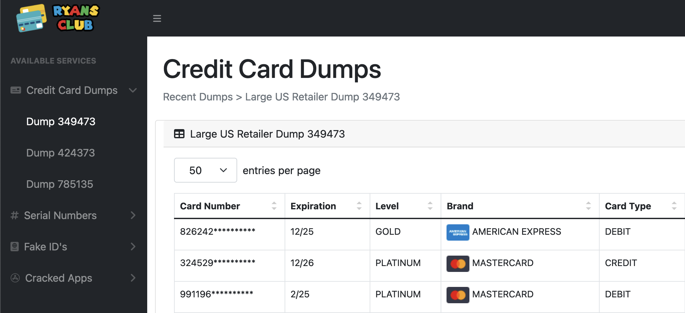
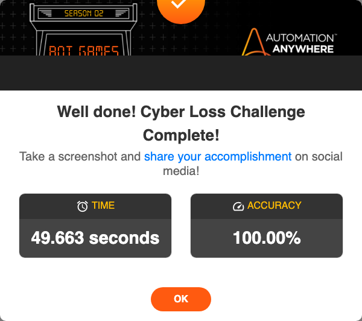

# Cyber Loss Prevention Challenge



This robot solves the [Cyber Loss Prevention Challenge](https://developer.automationanywhere.com/challenges/automationanywherelabs-cyberlossprevention.html).

> The Cyber Loss Prevention team at Eagle One Financial has reached out to you for help: Help the team by scraping all the leaked credit card numbers available for sale at "Ryan’s Club", run them against a database of Eagle One Financial customers to identify if any of Eagle One’s customers have been impacted, and capture the details for each impacted customer in a CSV so that Eagle One Financial can proactively deactivate and re-issue cards for impacted customers.

## The robot code

> Note: There is no one and only "correct" solution. This is just one example of how you _might_ use Robocorp to solve this challenge.

The robot is split into multiple files.

### tasks.robot

The `tasks.robot` file defines the high-level task. The keywords are split to separate robot files to avoid a long robot file. The separate robot files are imported using the `Resource` definition in the `Settings` section.

This robot uses the following libraries:

- [Collections](https://robocorp.com/docs/libraries/built-in/collections)
- [OperatingSystem](https://robocorp.com/docs/libraries/built-in/operatingsystem)
- [RPA.Browser.Playwright](https://robocorp.com/docs/libraries/rpa-framework/rpa-browser-playwright)
- [RPA.Database](https://robocorp.com/docs/libraries/rpa-framework/rpa-database)
- [RPA.HTTP](https://robocorp.com/docs/libraries/rpa-framework/rpa-http)
- [RPA.Robocorp.Vault](https://robocorp.com/docs/libraries/rpa-framework/rpa-robocorp-vault)
- [String](https://robocorp.com/docs/libraries/built-in/string)

```robot
*** Settings ***
Documentation     Completes the Cyber Loss Prevention challenge.
Resource          csv.robot
Resource          database.robot
Resource          scraper.robot
Resource          shared.robot

*** Tasks ***
Complete the Cyber Loss Prevention challenge
    ${eagle_one_financial_page}=    Open the Eagle One Financial website
    Open the Ryan's Club website
    Log in to Ryan's Club website
    Accept cookies
    Open the credit card dump page
    ${credit_card_dump_data}=    Scrape credit card dump data
    Switch Page    ${eagle_one_financial_page}[page_id]
    Download the customer database
    ${compromised_customers}=
    ...    Query compromised customers from database
    ...    ${credit_card_dump_data}
    Fill in cancellations CSV    ${compromised_customers}
    Upload cancellations CSV
    Take a screenshot of the result

*** Keywords ***
Open the Eagle One Financial website
    New Context    userAgent=Chrome/100.0.4896.75
    ${eagle_one_financial_page}=
    ...    New Page
    ...    https://developer.automationanywhere.com/challenges/automationanywherelabs-cyberlossprevention.html
    [Return]    ${eagle_one_financial_page}

Open the Ryan's Club website
    Click    text="Ryan's Club Login"
    Switch Page    NEW

Take a screenshot of the result
    Sleep    1 second
    Take Screenshot    selector=css=#myModal .modal-content
```

### shared.robot

There are a couple of libraries that are needed in multiple robot files. These are placed in the `shared.robot` file, which can then be imported to other robot files.

```robot
*** Settings ***
Library           Collections
Library           RPA.Browser.Playwright
```

### scraper.robot

The `scraper.robot` contains the web scraping logic for the credit card dump data.

The login credentials are retrieved from the [vault](https://robocorp.com/docs/development-guide/variables-and-secrets/vault).

The robot figures out the number of pages it needs to scrape by looking at the pager element. It scrapes the data from the table on each page and returns a list of dictionaries containing the customer and card data.

```robot
*** Settings ***
Library           RPA.Robocorp.Vault
Library           String
Resource          shared.robot

*** Keywords ***
Log in to Ryan's Club website
    ${secret}=    Get Secret    ryansClub
    Fill Secret    id=email    ${secret}[username]
    Fill Secret    id=password    ${secret}[password]
    Sleep    0.5s
    Click    id=login

Accept cookies
    Click    id=onetrust-accept-btn-handler

Open the credit card dump page
    Click    css=a.btn[href="automationanywherelabs-ryansclub_ccdumps_349473.html"]

Scrape credit card dump data
    ${page_count}=    Get page count
    ${credit_card_dump_data}=    Create List
    FOR    ${counter}    IN RANGE    1    ${page_count} + 1
        ${rows}=    Get Elements    css=#transactions tr
        FOR    ${row}    IN    @{rows}
            ${card_number}=    Get cell text    ${row}    1
            ${card_number_start}=    Fetch From Left    ${card_number}    *
            ${expiration}=    Get cell text    ${row}    2
            ${level}=    Get cell text    ${row}    3
            ${brand}=    Get cell text    ${row}    4
            ${card_type}=    Get cell text    ${row}    5
            ${last_name}=    Get cell text    ${row}    6
            ${city_and_state}=    Get cell text    ${row}    7
            ${city}=    Fetch From Left    ${city_and_state}    ;
            ${state}=    Fetch From Right    ${city_and_state}    ;
            ${zip}=    Get cell text    ${row}    8
            ${country}=    Get cell text    ${row}    9
            ${data}=
            ...    Create Dictionary
            ...    card_number=${card_number}
            ...    card_number_start=${card_number_start}
            ...    expiration=${expiration}
            ...    level=${level}
            ...    brand=${brand}
            ...    card_type=${card_type}
            ...    last_name=${last_name}
            ...    city=${city}
            ...    state=${state}
            ...    zip=${zip}
            ...    country=${country}
            Append To List    ${credit_card_dump_data}    ${data}
        END
        IF    ${counter} != ${page_count}
            Click    css=li.pager:last-child
        END
    END
    [Return]    ${credit_card_dump_data}

Get page count
    ${page_count}=
    ...    Get Attribute
    ...    css=.dataTable-pagination .ellipsis + li a
    ...    data-page
    [Return]    ${page_count}

Get cell text
    [Arguments]    ${row}    ${cell_index}
    ${text}=    Get Text    ${row} >> css=td:nth-child(${cell_index})
    ${text}    Strip String    ${text}
    [Return]    ${text}
```

### database.robot

The customer data is stored in an [SQLite database](https://www.sqlite.org/index.html). The robot downloads the database file using the [RPA.HTTP](https://robocorp.com/docs/libraries/rpa-framework/rpa-http) library, connects to the database using the [RPA.Database](https://robocorp.com/docs/libraries/rpa-framework/rpa-database) library, and uses [SQL](https://en.wikipedia.org/wiki/SQL) to query each of the customers found in the credit card data dump. If a match is found, that customer is compromised and needs to be reported using the cancellation [CSV file](https://en.wikipedia.org/wiki/Comma-separated_values).

The [Catenate](https://robocorp.com/docs/libraries/built-in/builtin/keywords#catenate) keyword is used to break the SQL statement on multiple lines for better readability.

```robot
*** Settings ***
Library           RPA.Database
Library           RPA.HTTP
Resource          shared.robot

*** Variables ***
${CUSTOMER_DATABASE}=    ${OUTPUT_DIR}${/}CustomerData.db

*** Keywords ***
Download the customer database
    ${database_download_url}=
    ...    Get Attribute
    ...    css=a >> text="Customer Database Download"
    ...    href
    RPA.HTTP.Download    ${database_download_url}    ${CUSTOMER_DATABASE}

Query compromised customers from database
    [Arguments]    ${customers}
    Connect To Database    sqlite3    ${CUSTOMER_DATABASE}
    ${compromised_customers}=    Create List
    FOR    ${customer}    IN    @{customers}
        ${query}=    Catenate    SEPARATOR=${SPACE}
        ...    SELECT
        ...    cu.customer_id,
        ...    cu.first_name,
        ...    cu.last_name,
        ...    ca.card_number,
        ...    ca.cvv,
        ...    ca.brand
        ...    FROM customer_details cu
        ...    JOIN card_details ca
        ...    ON cu.customer_id = ca.id
        ...    WHERE cu.last_name = "${customer}[last_name]"
        ...    AND cu.country = "${customer}[country]"
        ...    AND cu.zip = "${customer}[zip]"
        ...    AND cu.city = "${customer}[city]"
        ...    AND cu.state = "${customer}[state]"
        ...    AND ca.level = "${customer}[level]"
        ...    AND ca.brand = "${customer}[brand]"
        ...    AND ca.card_number LIKE "${customer}[card_number_start]%"
        ...    AND ca.expiration = "${customer}[expiration]"
        ...    AND ca.card_type = "${customer}[card_type]"
        ${rows}=    Query    ${query}    as_table=False
        IF    ${rows}
            Append To List    ${compromised_customers}    ${rows}[0]
        END
    END
    [Return]    ${compromised_customers}
```

### csv.robot

The `csv.robot` contains the CSV logic. The [Evaluate](https://robocorp.com/docs/libraries/built-in/builtin/keywords#evaluate) keyword executes a Python expression that transforms each customer data dictionary into a comma-separated string that is then appended to the CSV file. Finally, the CSV file is uploaded.

```robot
*** Settings ***
Library           OperatingSystem
Resource          shared.robot

*** Variables ***
${CANCELLATIONS_CSV}=    ${OUTPUT_DIR}${/}cancellations.csv

*** Keywords ***
Fill in cancellations CSV
    [Arguments]    ${customers}
    Copy File
    ...    %{ROBOT_ROOT}${/}resources${/}cancellations_template.csv
    ...    ${CANCELLATIONS_CSV}
    FOR    ${customer}    IN    @{customers}
        ${comma_separated_string}=
        ...    Evaluate
        ...    ','.join(map(str, ${customer}))
        Append To File
        ...    ${CANCELLATIONS_CSV}
        ...    ${comma_separated_string}${\n}
    END

Upload cancellations CSV
    Upload File By Selector    id=fileToUpload    ${CANCELLATIONS_CSV}
    Click    id=btnUploadFile
```

### Take a screenshot of the result

Finally, the robot takes a screenshot of the result modal.


